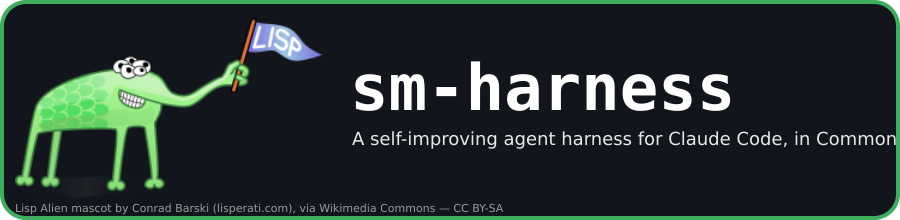

# sm-harness

[](LICENSE)
[](https://www.youtube.com/watch?v=3IkrGNwkdJk)

A self-improving agent harness for Claude Code, written in Common Lisp.

`sm-harness` runs Claude Code agent sessions (via a browser chat UI or
headlessly) with a tool catalog that includes `bash`, `read_file`,
`write_file` — and `reload_harness`. That last one is the point: the agent
serving a session can read its own Lisp source under `harness/`, edit it,
and hot-reload the change into the very SBCL process that is running the
conversation, without restarting anything. The harness can debug, extend,
and fix itself mid-session, and those edits land as ordinary commits on the
host repo, not throwaway container state.

## Why Common Lisp

A self-modifying, always-on service needs a runtime built for exactly that:

- **Image-based development.** Functions, classes, and conditions can be
  redefined in a live image (via ASDF reload) instead of requiring a
  process restart to pick up changed code — the same capability Lisp has
  offered interactive development for decades, put to use keeping a
  long-running agent process patchable while it's serving traffic.
- **CLOS and conditions** give the harness's session/tool/backend model and
  its error handling real structure without a heavyweight framework.
- **Flexibility over ceremony.** Small, composable definitions (tool
  catalogs, options, protocol decoding) are easy to grow without fighting
  the language, which matters when the software's main job is being edited
  by the thing running inside it.

## Backend: Claude Code, subscription-friendly

The harness drives an installed `claude` Code CLI as a subprocess over its
JSONL/control protocol (`claude-agent-sdk-cl`) rather than talking to the
Anthropic Messages API directly. It authenticates with a single
`CLAUDE_CODE_OAUTH_TOKEN` — the same token a **Claude Code subscription**
(Pro/Max) issues via `claude setup-token` — so running this harness doesn't
require separate pay-per-token API billing.

## Forking this repo to build an app

This repo is meant to be forked as a starting point, not just run as-is.
The intended shape after forking:

```text
repo-root/
  harness/   # this project: sm-harness, sm-harness-web-ui, claude-agent-sdk-cl
  app/       # the product you're building, developed by/with the harness
```

Fork the repo, then have the harness build your application into a new
`app/` directory at the repo root, alongside `harness/` rather than
replacing it. Both directories are ordinary, tracked parts of the same
git repository: the compose setup already bind-mounts the whole repo
read-write into the container (`../:/app` in
`harness/compose.sm-harness-web-ui.yaml`), so an agent session's
`write_file`/`reload_harness` edits under `harness/` and its normal edits
under `app/` are both just commits in one working tree.

The important part is that `harness/` is not scaffolding to delete once
`app/` exists. It stays in the repo and keeps evolving the same
self-improving way described above — new tools, fixes, or workflow changes
the harness needs while building your app land as commits in `harness/`
right alongside the `app/` commits that needed them, so the harness that
built your app, and its full history of doing so, ships with it.

## Layout

- `harness/` — the whole harness project: the `claude-agent-sdk-cl`
  library, `sm-harness` (the session/tool runtime), and
  `sm-harness-web-ui` (the CLOG browser chat UI), plus tests and Docker
  tooling.
- `app/` — not present in this repo yet; where a fork's own application
  code goes, per [Forking this repo to build an
  app](#forking-this-repo-to-build-an-app) above.
- `harness/docs/` — the real documentation: start with
  [`sm-harness.md`](harness/docs/sm-harness.md) and
  [`sm-harness-web-ui.md`](harness/docs/sm-harness-web-ui.md).
- `harness/README.md` — the `claude-agent-sdk-cl` library README (install,
  API, Docker-only test ladder).

## License

MIT — see [`LICENSE`](LICENSE).

## Status

Under active, self-hosted development — see `harness/PLAN.md` and the
project's GitHub issues for current scope.
